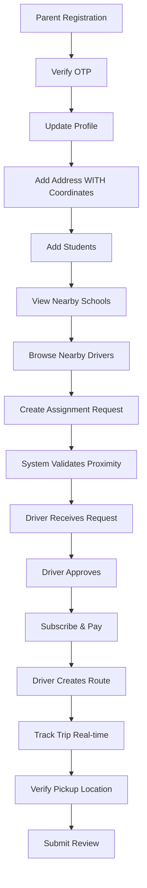
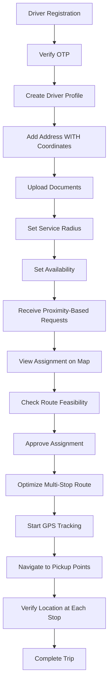
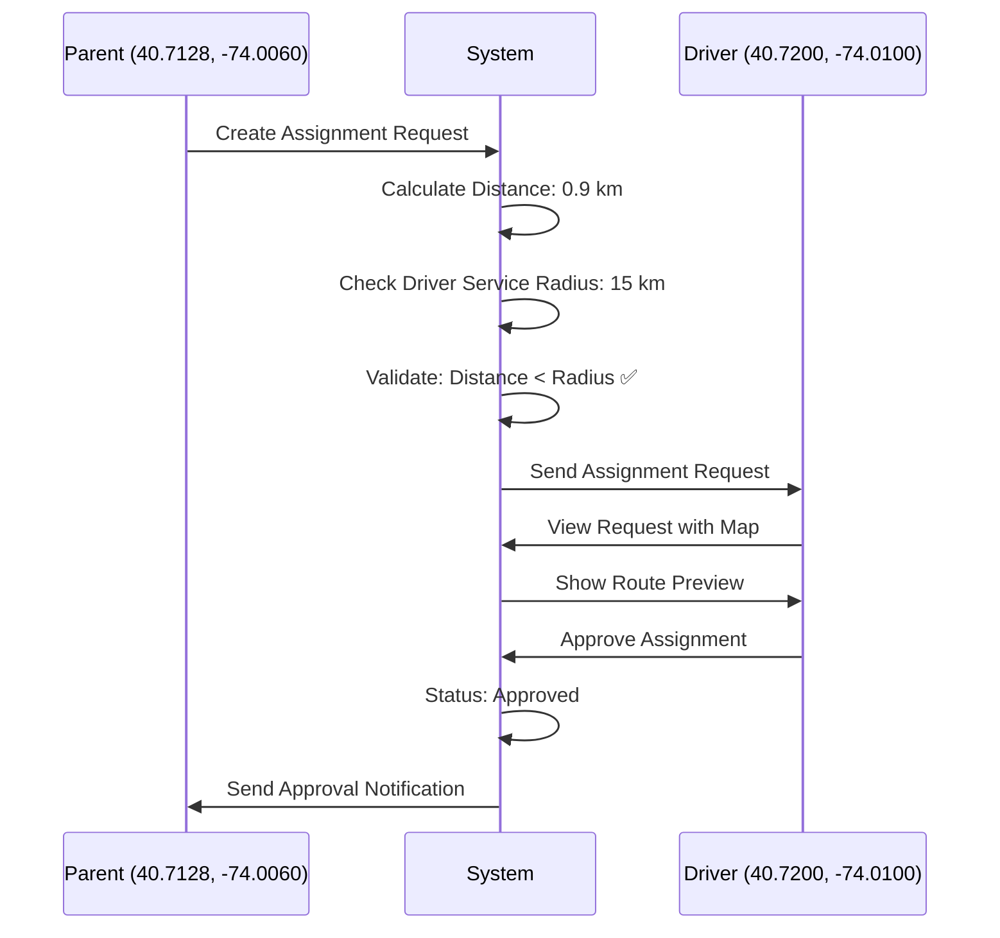

# Testing Data & End-to-End Testing Guide

**Version:** 1.0.0
**Last Updated:** 2025-01-31

---

## Table of Contents

1. [Overview](#overview)
2. [Test Users](#test-users)
3. [Test Schools](#test-schools)
4. [Test Students](#test-students)
5. [Test Subscription Plans](#test-subscription-plans)
6. [Testing Workflows](#testing-workflows)
7. [Sample API Requests](#sample-api-requests)
8. [Testing Scenarios](#testing-scenarios)

---

## Overview

This document provides comprehensive testing data for the Ping Parent application. Use this data to perform end-to-end testing across all modules including authentication, assignments, trips, payments, and notifications.

### Testing Environment

- **Base URL (Local):** `http://localhost:3000/api`
- **Base URL (Staging):** `https://staging-api.pingparent.com/api`

### ⚠️ CRITICAL: Location Data Requirement

**IMPORTANT:** All addresses MUST include latitude and longitude coordinates. The application is location-based and relies on GPS coordinates for:
- Route optimization and planning
- Real-time driver tracking
- Distance calculations
- Pickup/drop location verification
- Parent-Driver proximity matching

**❌ Addresses without coordinates will be REJECTED**

### Test Data Structure

The testing follows a logical flow:
1. Create Admin → Create Schools (with coordinates)
2. Register Parents → Add Students
3. Register Drivers → Upload Documents
4. **Add Addresses (MUST have lat/long for both Parent & Driver)**
5. Create Subscription Plans
6. Parents Subscribe → Make Payments
7. Create Assignments (system matches based on proximity)
8. Create Trips → Mark Attendance
9. Generate QR/OTP → Verify (with location)
10. Submit Reviews

---

## Test Users

### Admin Accounts

| Field | Admin 1 (Super Admin) | Admin 2 (Support Admin) |
|-------|----------------------|-------------------------|
| **Username** | `admin_super` | `admin_support` |
| **Password** | `Admin@123456` | `Support@123456` |
| **Name** | Super Admin | Support Admin |
| **Email** | admin@pingparent.com | support@pingparent.com |
| **Role** | Super Admin | Support Admin |
| **Permissions** | All permissions | Limited (view only) |
| **Status** | Active | Active |
| **Use Case** | Full system management | View audit logs, support tickets |

**Admin Login Credentials:**
```json
{
  "username": "admin_super",
  "password": "Admin@123456"
}
```

---

### Parent Accounts

| Field | Parent 1 (John Doe) | Parent 2 (Sarah Williams) | Parent 3 (Robert Brown) |
|-------|---------------------|---------------------------|------------------------|
| **Phone** | `+1234567890` | `+1234567891` | `+1234567892` |
| **OTP** | `123456` | `123456` | `123456` |
| **Name** | John Doe | Sarah Williams | Robert Brown |
| **Email** | john.doe@parent.com | sarah.williams@parent.com | robert.brown@parent.com |
| **Role** | parent | parent | parent |
| **Alternate Phone** | `+1987654320` | `+1987654321` | `+1987654322` |
| **Status** | Active | Active | Active |
| **Students** | 2 (Emily, Michael) | 1 (Sophie) | 2 (David, Emma) |
| **Subscription** | Monthly Plan | Quarterly Plan | Monthly Plan |
| **Payment Status** | Completed | Completed | Pending |

### 📍 Parent Address Data (WITH MANDATORY COORDINATES)

> **⚠️ CRITICAL:** Coordinates are REQUIRED for address operations

| Parent | Street | City | State | ZIP | **Latitude** | **Longitude** | Location Description |
|--------|--------|------|-------|-----|--------------|---------------|---------------------|
| **John Doe** | 123 Main St | New York | NY | 10001 | **40.7128** | **-74.0060** | Manhattan, NYC |
| **Sarah Williams** | 456 Oak Ave | Los Angeles | CA | 90001 | **34.0522** | **-118.2437** | Downtown LA |
| **Robert Brown** | 789 Pine Rd | Chicago | IL | 60601 | **41.8781** | **-87.6298** | Chicago Loop |

**Parent Registration Flow:**
```json
// Step 1: Send OTP
{
  "phone": "+1234567890",
  "role": "parent"
}

// Step 2: Verify OTP & Register
{
  "phone": "+1234567890",
  "otp": "123456",
  "name": "John Doe",
  "email": "john.doe@parent.com"
}

// Step 3: Add Address (COORDINATES MANDATORY)
{
  "street": "123 Main St",
  "city": "New York",
  "state": "NY",
  "zip_code": "10001",
  "coordinates": {
    "latitude": 40.7128,     // ⚠️ REQUIRED
    "longitude": -74.0060    // ⚠️ REQUIRED
  }
}
```

---

### Driver Accounts

| Field | Driver 1 (Jane Smith) | Driver 2 (Mike Johnson) | Driver 3 (Lisa Davis) |
|-------|----------------------|------------------------|----------------------|
| **Phone** | `+1234567893` | `+1234567894` | `+1234567895` |
| **OTP** | `123456` | `123456` | `123456` |
| **Name** | Jane Smith | Mike Johnson | Lisa Davis |
| **Email** | jane.smith@driver.com | mike.johnson@driver.com | lisa.davis@driver.com |
| **Role** | driver | driver | driver |
| **License Number** | DL-NY-123456 | DL-CA-789012 | DL-IL-345678 |
| **Vehicle Number** | NY-ABC-1234 | CA-XYZ-5678 | IL-DEF-9012 |
| **Vehicle Type** | Sedan | SUV | Van |
| **Vehicle Model** | Toyota Camry 2023 | Honda CR-V 2024 | Ford Transit 2023 |
| **Capacity** | 4 students | 6 students | 10 students |
| **Status** | Active | Active | Active |
| **Availability** | Available | Available | Unavailable |
| **Rating** | 4.8 (25 reviews) | 4.5 (18 reviews) | 5.0 (12 reviews) |
| **Assigned Students** | 3 | 2 | 0 |

### 📍 Driver Address Data (WITH MANDATORY COORDINATES)

> **⚠️ CRITICAL:** Driver addresses MUST have coordinates for route planning

| Driver | Street | City | State | ZIP | **Latitude** | **Longitude** | Location Description |
|--------|--------|------|-------|-----|--------------|---------------|---------------------|
| **Jane Smith** | 111 Driver Lane | New York | NY | 10002 | **40.7200** | **-74.0100** | Lower East Side, NYC |
| **Mike Johnson** | 222 Route Blvd | Los Angeles | CA | 90002 | **34.0600** | **-118.2500** | East LA |
| **Lisa Davis** | 333 Highway St | Chicago | IL | 60602 | **41.8800** | **-87.6300** | Chicago West Loop |

**Driver Address Setup (MANDATORY):**
```json
{
  "street": "111 Driver Lane",
  "city": "New York",
  "state": "NY",
  "zip_code": "10002",
  "coordinates": {
    "latitude": 40.7200,     // ⚠️ REQUIRED - Used for route optimization
    "longitude": -74.0100    // ⚠️ REQUIRED - Used for proximity matching
  }
}
```

**Driver Documents:**

| Driver | License | Vehicle Reg | Insurance | Background Check |
|--------|---------|-------------|-----------|------------------|
| Jane Smith | ✅ Verified (Exp: 2026-12-31) | ✅ Verified (Exp: 2025-12-31) | ✅ Verified (Exp: 2025-06-30) | ✅ Verified |
| Mike Johnson | ✅ Verified (Exp: 2027-06-30) | ✅ Verified (Exp: 2025-11-30) | ✅ Verified (Exp: 2025-08-31) | ✅ Verified |
| Lisa Davis | ⏳ Pending (Exp: 2026-09-30) | ⏳ Pending (Exp: 2025-10-31) | ✅ Verified (Exp: 2025-07-31) | ✅ Verified |

**Driver Registration & Profile Setup:**
```json
// Step 1: Register (Same as Parent)
// Step 2: Create Profile
{
  "name": "Jane Smith",
  "email": "jane.smith@driver.com",
  "alternate_phone": "+1987654323",
  "license_number": "DL-NY-123456",
  "vehicle_number": "NY-ABC-1234",
  "vehicle_type": "Sedan",
  "vehicle_model": "Toyota Camry 2023"
}

// Step 3: Add Address (COORDINATES MANDATORY)
{
  "street": "111 Driver Lane",
  "city": "New York",
  "state": "NY",
  "zip_code": "10002",
  "coordinates": {
    "latitude": 40.7200,     // ⚠️ REQUIRED
    "longitude": -74.0100    // ⚠️ REQUIRED
  }
}

// Step 4: Upload Documents
{
  "document_type": "license",
  "document_url": "https://storage.pingparent.com/docs/license_jane.pdf",
  "expiry_date": "2026-12-31"
}
```

---

## Test Schools

### 📍 School Locations (WITH MANDATORY COORDINATES)

> **⚠️ CRITICAL:** School addresses MUST have coordinates for route calculations

| Field | School 1 | School 2 | School 3 |
|-------|----------|----------|----------|
| **School ID** | `SCH001` | `SCH002` | `SCH003` |
| **Name** | Springfield Elementary | Lincoln High School | Washington Middle School |
| **Street** | 100 School St | 200 Education Blvd | 300 Learning Ave |
| **City** | New York | Los Angeles | Chicago |
| **State** | NY | CA | IL |
| **ZIP** | 10003 | 90003 | 60603 |
| **Latitude** | **40.7589** | **34.0400** | **41.8700** |
| **Longitude** | **-73.9851** | **-118.2700** | **-87.6500** |
| **Phone** | `+1234567896` | `+1234567897` | `+1234567898` |
| **Email** | info@springfield.edu | contact@lincoln.edu | admin@washington.edu |
| **Principal** | Dr. John Smith | Dr. Sarah Johnson | Dr. Michael Brown |
| **Grades** | K-5 | 9-12 | 6-8 |
| **Total Students** | 450 | 800 | 350 |
| **Status** | Active | Active | Active |

**School Creation (Admin Only) - WITH COORDINATES:**
```json
{
  "school_id": "SCH001",
  "name": "Springfield Elementary",
  "address": {
    "street": "100 School St",
    "city": "New York",
    "state": "NY",
    "zip_code": "10003",
    "coordinates": {
      "latitude": 40.7589,     // ⚠️ REQUIRED - Drop-off destination
      "longitude": -73.9851    // ⚠️ REQUIRED - Pickup starting point
    }
  },
  "phone": "+1234567896",
  "email": "info@springfield.edu",
  "principal_name": "Dr. John Smith"
}
```

---

## Test Students

### Students for Parent 1 (John Doe)

| Field | Student 1 | Student 2 |
|-------|-----------|-----------|
| **Student ID** | `STU001` | `STU002` |
| **Name** | Emily Johnson | Michael Johnson |
| **Parent** | John Doe (+1234567890) | John Doe (+1234567890) |
| **Parent Address** | 123 Main St, NYC (40.7128, -74.0060) | 123 Main St, NYC (40.7128, -74.0060) |
| **School** | Springfield Elementary (SCH001) | Springfield Elementary (SCH001) |
| **School Address** | 100 School St, NYC (40.7589, -73.9851) | 100 School St, NYC (40.7589, -73.9851) |
| **Distance to School** | ~5.2 km | ~5.2 km |
| **Grade** | 5th Grade | 3rd Grade |
| **Section** | A | B |
| **Age** | 10 | 8 |
| **Gender** | Female | Male |
| **Status** | Active | Active |
| **Assigned Driver** | Jane Smith (40.7200, -74.0100) | Jane Smith (40.7200, -74.0100) |
| **Driver Distance from Parent** | ~0.9 km | ~0.9 km |
| **Assignment Status** | Approved | Approved |

### Students for Parent 2 (Sarah Williams)

| Field | Student 3 |
|-------|-----------|
| **Student ID** | `STU003` |
| **Name** | Sophie Williams |
| **Parent** | Sarah Williams (+1234567891) |
| **Parent Address** | 456 Oak Ave, LA (34.0522, -118.2437) |
| **School** | Lincoln High School (SCH002) |
| **School Address** | 200 Education Blvd, LA (34.0400, -118.2700) |
| **Distance to School** | ~2.9 km |
| **Grade** | 10th Grade |
| **Section** | A |
| **Age** | 15 |
| **Gender** | Female |
| **Status** | Active |
| **Assigned Driver** | Mike Johnson (34.0600, -118.2500) |
| **Driver Distance from Parent** | ~0.9 km |
| **Assignment Status** | Approved |

### Students for Parent 3 (Robert Brown)

| Field | Student 4 | Student 5 |
|-------|-----------|-----------|
| **Student ID** | `STU004` | `STU005` |
| **Name** | David Brown | Emma Brown |
| **Parent** | Robert Brown (+1234567892) | Robert Brown (+1234567892) |
| **Parent Address** | 789 Pine Rd, Chicago (41.8781, -87.6298) | 789 Pine Rd, Chicago (41.8781, -87.6298) |
| **School** | Washington Middle (SCH003) | Springfield Elementary (SCH001) |
| **School Address** | 300 Learning Ave, Chicago (41.8700, -87.6500) | 100 School St, NYC (40.7589, -73.9851) |
| **Distance to School** | ~2.3 km | ~1152 km (Different city!) |
| **Grade** | 7th Grade | 4th Grade |
| **Section** | C | A |
| **Age** | 12 | 9 |
| **Gender** | Male | Female |
| **Status** | Active | Active |
| **Assigned Driver** | Mike Johnson | Jane Smith |
| **Assignment Status** | Pending | Rejected (Too far) |

**Student Creation:**
```json
{
  "student_id": "STU001",
  "name": "Emily Johnson",
  "school_id": "SCH001",
  "grade": "5th Grade",
  "section": "A",
  "age": 10,
  "gender": "female"
}
```

> **Note:** Student addresses inherit from parent address. Parent address MUST have coordinates before adding students.

---

## Test Subscription Plans

| Field | Plan 1 | Plan 2 | Plan 3 | Plan 4 |
|-------|--------|--------|--------|--------|
| **Plan ID** | `PLAN001` | `PLAN002` | `PLAN003` | `PLAN004` |
| **Name** | Monthly Basic | Quarterly Standard | Semi-Annual Premium | Annual Ultimate |
| **Price** | $99.99 | $269.97 | $499.99 | $899.99 |
| **Duration** | 30 days | 90 days | 180 days | 365 days |
| **Discount** | 0% | 10% | 17% | 25% |
| **Features** | Basic tracking, QR attendance | + Priority support | + Multiple students | + Premium benefits |
| **Status** | Active | Active | Active | Active |

**Features Breakdown:**

| Feature | Monthly | Quarterly | Semi-Annual | Annual |
|---------|---------|-----------|-------------|--------|
| Daily pickup/drop | ✅ | ✅ | ✅ | ✅ |
| Real-time GPS tracking | ✅ | ✅ | ✅ | ✅ |
| QR/OTP attendance | ✅ | ✅ | ✅ | ✅ |
| Location-based notifications | ✅ | ✅ | ✅ | ✅ |
| Route optimization | ✅ | ✅ | ✅ | ✅ |
| Push notifications | ✅ | ✅ | ✅ | ✅ |
| 24/7 support | Basic | Priority | Priority | Premium |
| Multiple students | 1 | 2 | 3 | Unlimited |
| Trip history (days) | 30 | 90 | 180 | 365 |
| Monthly reports | ❌ | ✅ | ✅ | ✅ |
| Dedicated manager | ❌ | ❌ | ❌ | ✅ |

---

## Testing Workflows

### Workflow 1: Complete Parent Journey (Location-Aware)



**Step-by-Step Testing (WITH LOCATION VALIDATION):**

| Step | Action | Endpoint | Required Data | Expected Result |
|------|--------|----------|---------------|----------------|
| 1 | Send Registration OTP | `POST /auth/register/send-otp` | `{"phone": "+1234567890", "role": "parent"}` | OTP sent to +1234567890 |
| 2 | Verify OTP & Register | `POST /auth/register/verify-otp` | `{"phone": "+1234567890", "otp": "123456", "name": "John Doe"}` | User created, JWT token returned |
| 3 | Update Profile | `PUT /parent/profile` | `{"email": "john@parent.com"}` | Profile updated |
| 4 | **Add Address (COORDINATES REQUIRED)** | `PUT /parent/address` | `{"street": "123 Main St", "city": "New York", "state": "NY", "zip_code": "10001", "coordinates": {"latitude": 40.7128, "longitude": -74.0060}}` | **Address saved WITH coordinates** |
| 5 | Add First Student | `POST /students` | `{"student_id": "STU001", "name": "Emily Johnson", "school_id": "SCH001", "grade": "5th Grade"}` | Student created (inherits parent address) |
| 6 | Add Second Student | `POST /students` | `{"student_id": "STU002", "name": "Michael Johnson", "school_id": "SCH001", "grade": "3rd Grade"}` | Student created |
| 7 | Get Nearby Schools | `GET /schools?lat=40.7128&lng=-74.0060&radius=10` | Parent coordinates | Returns schools within 10km |
| 8 | **Create Assignment (Proximity Check)** | `POST /driver-student-assignments` | `{"student_id": "STU001", "driver_id": "DRIVER001"}` | **System validates driver is within serviceable range** |
| 9 | View Subscription Plans | `GET /subscription-plans` | - | Returns 4 plans |
| 10 | Subscribe to Plan | `POST /parent-subscriptions` | `{"plan_id": "PLAN001"}` | Subscription created |
| 11 | Make Payment | `POST /payments` | `{"subscription_id": "SUB001", "amount": 99.99}` | Payment initiated |
| 12 | Complete Payment | `POST /payments/:id/complete` | - | Payment completed |

---

### Workflow 2: Complete Driver Journey (Location-Based)



**Step-by-Step Testing (WITH LOCATION VALIDATION):**

| Step | Action | Endpoint | Required Data | Expected Result |
|------|--------|----------|---------------|----------------|
| 1 | Send Registration OTP | `POST /auth/register/send-otp` | `{"phone": "+1234567893", "role": "driver"}` | OTP sent |
| 2 | Verify & Register | `POST /auth/register/verify-otp` | `{"phone": "+1234567893", "otp": "123456", "name": "Jane Smith"}` | Driver created |
| 3 | Create Profile | `POST /driver/profile` | `{"license_number": "DL-NY-123456", "vehicle_number": "NY-ABC-1234"}` | Profile created |
| 4 | **Add Address (COORDINATES REQUIRED)** | `POST /driver/address` | `{"street": "111 Driver Lane", "coordinates": {"latitude": 40.7200, "longitude": -74.0100}}` | **Address WITH coordinates saved** |
| 5 | Upload Documents | `POST /driver/documents` | `{"document_type": "license", "document_url": "..."}` | Documents uploaded |
| 6 | Set Availability | `PATCH /driver/availability` | `{"is_available": true, "service_radius_km": 15}` | Available within 15km radius |
| 7 | **View Nearby Requests** | `GET /driver-student-assignments/driver/my-pending-assignments` | - | **Only shows requests within service radius** |
| 8 | Check Route | Internal calculation | - | System shows route: Driver → Student1 → Student2 → School |
| 9 | Approve Assignment | `POST /driver-student-assignments/:id/approve` | - | Assignment approved |
| 10 | **Create Trip with Route** | `POST /trips` | `{"trip_type": "pickup", "route_details": {...}}` | **Trip with optimized route created** |
| 11 | **Start GPS Tracking** | `PATCH /trips/:id/status` | `{"status": "in_progress"}` | Real-time tracking begins |
| 12 | **Record Pickup with Location** | `PUT /trip-students/.../pickup` | `{"pickup_time": "...", "location": {"latitude": 40.7128, "longitude": -74.0060}}` | **Pickup recorded WITH GPS coordinates** |

---

### Workflow 3: Location-Based Assignment Validation



**Testing Location Validation:**

| Scenario | Parent Location | Driver Location | School Location | Distance | Service Radius | Result |
|----------|----------------|-----------------|-----------------|----------|----------------|--------|
| ✅ Valid | 40.7128, -74.0060 | 40.7200, -74.0100 | 40.7589, -73.9851 | 0.9 km | 15 km | **Approved** |
| ❌ Too Far | 40.7128, -74.0060 | 34.0522, -118.2437 | 40.7589, -73.9851 | 3935 km | 15 km | **Rejected** |
| ⚠️ Edge Case | 40.7128, -74.0060 | 40.8500, -74.0060 | 40.7589, -73.9851 | 15.3 km | 15 km | **Rejected** |

---

### Workflow 4: Daily Trip with GPS Tracking


**Testing GPS-Tracked Trip:**

| Step | Time | GPS Location (Lat, Long) | Action | Endpoint | Location Verified |
|------|------|--------------------------|--------|----------|-------------------|
| 1 | 06:00 AM | - | Generate QR/OTP | `POST /daily-qr-otp/generate` | - |
| 2 | 06:30 AM | - | Create trip | `POST /trips` | - |
| 3 | 07:00 AM | 40.7200, -74.0100 | Start trip | `PATCH /trips/:id/status` | ✅ Driver home |
| 4 | 07:15 AM | 40.7128, -74.0060 | Arrive Emily's home | - | ✅ Parent address match |
| 5 | 07:16 AM | 40.7128, -74.0060 | Scan QR | `POST /daily-qr-otp/verify` | ✅ Location verified |
| 6 | 07:17 AM | 40.7128, -74.0060 | **Record pickup WITH GPS** | `PUT /trip-students/.../pickup` | **✅ GPS coordinates saved** |
| 7 | 07:30 AM | 40.7200, -74.0080 | Arrive Michael's home | - | ✅ Parent address match |
| 8 | 07:31 AM | 40.7200, -74.0080 | Scan QR | `POST /daily-qr-otp/verify` | ✅ Location verified |
| 9 | 07:32 AM | 40.7200, -74.0080 | **Record pickup WITH GPS** | `PUT /trip-students/.../pickup` | **✅ GPS coordinates saved** |
| 10 | 08:00 AM | 40.7589, -73.9851 | Arrive at school | - | ✅ School address match |
| 11 | 08:00 AM | 40.7589, -73.9851 | Complete trip | `PATCH /trips/:id/status` | **✅ All GPS data recorded** |

---

## Sample API Requests

### 1. Parent Registration with Address (COORDINATES REQUIRED)

**Step 1: Send OTP**
```bash
curl -X POST http://localhost:3000/api/auth/register/send-otp \
  -H "Content-Type: application/json" \
  -d '{
    "phone": "+1234567890",
    "role": "parent"
  }'
```

**Step 2: Verify OTP & Register**
```bash
curl -X POST http://localhost:3000/api/auth/register/verify-otp \
  -H "Content-Type: application/json" \
  -d '{
    "phone": "+1234567890",
    "otp": "123456",
    "name": "John Doe",
    "email": "john.doe@parent.com"
  }'
```

**Step 3: Add Address (MANDATORY COORDINATES)**
```bash
curl -X PUT http://localhost:3000/api/parent/address \
  -H "Content-Type: application/json" \
  -H "Authorization: Bearer <PARENT_TOKEN>" \
  -d '{
    "street": "123 Main St",
    "city": "New York",
    "state": "NY",
    "zip_code": "10001",
    "coordinates": {
      "latitude": 40.7128,     // ⚠️ REQUIRED
      "longitude": -74.0060    // ⚠️ REQUIRED
    }
  }'
```

**Response (Success):**
```json
{
  "success": true,
  "message": "Address saved successfully",
  "data": {
    "street": "123 Main St",
    "city": "New York",
    "state": "NY",
    "zip_code": "10001",
    "coordinates": {
      "latitude": 40.7128,
      "longitude": -74.0060
    }
  }
}
```

**Response (Error - Missing Coordinates):**
```json
{
  "success": false,
  "message": "Validation error",
  "error": {
    "field": "coordinates",
    "message": "Coordinates (latitude and longitude) are required for address"
  }
}
```

---

### 2. Driver Address with Coordinates

```bash
curl -X POST http://localhost:3000/api/driver/address \
  -H "Content-Type: application/json" \
  -H "Authorization: Bearer <DRIVER_TOKEN>" \
  -d '{
    "street": "111 Driver Lane",
    "city": "New York",
    "state": "NY",
    "zip_code": "10002",
    "coordinates": {
      "latitude": 40.7200,     // ⚠️ REQUIRED - Used for route planning
      "longitude": -74.0100    // ⚠️ REQUIRED - Used for proximity matching
    }
  }'
```

---

### 3. Create School with Coordinates (Admin)

```bash
curl -X POST http://localhost:3000/api/schools/admin \
  -H "Content-Type: application/json" \
  -H "Authorization: Bearer <ADMIN_TOKEN>" \
  -d '{
    "school_id": "SCH001",
    "name": "Springfield Elementary",
    "address": {
      "street": "100 School St",
      "city": "New York",
      "state": "NY",
      "zip_code": "10003",
      "coordinates": {
        "latitude": 40.7589,     // ⚠️ REQUIRED - Destination point
        "longitude": -73.9851    // ⚠️ REQUIRED - Route endpoint
      }
    },
    "phone": "+1234567896",
    "email": "info@springfield.edu"
  }'
```

---

### 4. Record Pickup with GPS Location

```bash
curl -X PUT http://localhost:3000/api/trip-students/trip/507f1f77bcf86cd799439015/student/507f1f77bcf86cd799439011/pickup \
  -H "Content-Type: application/json" \
  -H "Authorization: Bearer <DRIVER_TOKEN>" \
  -d '{
    "pickup_time": "2025-02-01T07:15:00Z",
    "location": {
      "latitude": 40.7128,     // ⚠️ REQUIRED - Actual pickup location
      "longitude": -74.0060    // ⚠️ REQUIRED - Verified against parent address
    }
  }'
```

**System validates:**
- Pickup location is within acceptable range of parent address (~100m tolerance)
- GPS coordinates are valid (-90 to 90 for latitude, -180 to 180 for longitude)
- Timestamp is reasonable (within trip window)

---

### 5. Create Trip with Route Details

```bash
curl -X POST http://localhost:3000/api/trips \
  -H "Content-Type: application/json" \
  -H "Authorization: Bearer <DRIVER_TOKEN>" \
  -d '{
    "trip_type": "pickup",
    "scheduled_date": "2025-02-01",
    "start_time": "2025-02-01T07:00:00Z",
    "route_details": {
      "starting_point": {
        "name": "Driver Home",
        "coordinates": {
          "latitude": 40.7200,
          "longitude": -74.0100
        }
      },
      "stops": [
        {
          "sequence": 1,
          "student_id": "STU001",
          "student_name": "Emily Johnson",
          "address": "123 Main St",
          "coordinates": {
            "latitude": 40.7128,     // Student 1 pickup location
            "longitude": -74.0060
          },
          "estimated_time": "2025-02-01T07:15:00Z"
        },
        {
          "sequence": 2,
          "student_id": "STU002",
          "student_name": "Michael Johnson",
          "address": "123 Main St",
          "coordinates": {
            "latitude": 40.7128,     // Student 2 pickup location (same parent)
            "longitude": -74.0060
          },
          "estimated_time": "2025-02-01T07:20:00Z"
        }
      ],
      "destination": {
        "name": "Springfield Elementary",
        "school_id": "SCH001",
        "coordinates": {
          "latitude": 40.7589,     // School location
          "longitude": -73.9851
        }
      },
      "total_distance_km": 5.8,
      "estimated_duration_minutes": 25
    }
  }'
```

---

## Testing Scenarios

### Scenario 1: Location-Based Happy Path

**Objective:** Complete journey with valid GPS coordinates

**Pre-requisites:**
- All addresses have valid coordinates
- Driver and parent are within serviceable range
- School coordinates are set

**Steps:**

1. ✅ **Parent Setup with Coordinates**
   - Register parent
   - Add address: 123 Main St, NYC (40.7128, -74.0060)
   - Add 2 students
   - **Verify:** Address saved with coordinates

2. ✅ **Driver Setup with Coordinates**
   - Register driver
   - Create profile
   - Add address: 111 Driver Lane, NYC (40.7200, -74.0100)
   - Set service radius: 15 km
   - **Verify:** Driver can service this area

3. ✅ **Distance Validation**
   - System calculates: 0.9 km between parent and driver
   - **Verify:** Within service radius ✅

4. ✅ **Assignment Creation**
   - Parent creates assignment
   - System validates proximity
   - Driver receives request with map view
   - **Verify:** Assignment created

5. ✅ **GPS-Tracked Trip**
   - Driver creates trip with route
   - Starts GPS tracking
   - Records pickup locations
   - **Verify:** All GPS data captured

---

### Scenario 2: Invalid Address (No Coordinates)

**Objective:** Test rejection of addresses without coordinates

**Steps:**

1. Parent tries to add address without coordinates:
```json
{
  "street": "123 Main St",
  "city": "New York",
  "state": "NY",
  "zip_code": "10001"
  // ❌ Missing coordinates
}
```

2. **Expected Response:**
```json
{
  "success": false,
  "message": "Validation error: coordinates are required",
  "error": {
    "field": "coordinates",
    "message": "Both latitude and longitude must be provided for address"
  }
}
```

---

### Scenario 3: Out of Range Assignment

**Objective:** Test rejection when driver is too far

**Test Data:**

| Entity | Location | Coordinates |
|--------|----------|-------------|
| Parent (John) | New York, NY | 40.7128, -74.0060 |
| Driver (Mike) | Los Angeles, CA | 34.0522, -118.2437 |
| Distance | 3935 km | Too far |
| Driver Service Radius | 15 km | Not enough |

**Steps:**

1. Parent in NYC creates assignment with LA driver
2. System calculates distance: 3935 km
3. **Expected:** Assignment rejected - "Driver not available in your area"

---

### Scenario 4: Location Verification During Pickup

**Objective:** Verify GPS location matches during pickup

**Test Data:**

| Check | Expected Location | Actual GPS | Distance | Result |
|-------|------------------|------------|----------|--------|
| ✅ Valid | 40.7128, -74.0060 | 40.7130, -74.0062 | 25m | Accepted |
| ⚠️ Warning | 40.7128, -74.0060 | 40.7140, -74.0080 | 150m | Accepted with warning |
| ❌ Invalid | 40.7128, -74.0060 | 40.8000, -74.1000 | 10.2 km | Rejected |

**Steps:**

1. Driver arrives at pickup location
2. Driver attempts to record pickup
3. System compares GPS coordinates
4. If distance > 200m: Show warning "You appear to be far from the registered pickup location"
5. If distance > 1km: Block pickup "Please verify you are at the correct location"

---

## Location Data Reference

### Valid Coordinate Ranges

| Type | Minimum | Maximum | Example |
|------|---------|---------|---------|
| Latitude | -90° | +90° | 40.7128 (NYC) |
| Longitude | -180° | +180° | -74.0060 (NYC) |

### Distance Calculations

The system uses the **Haversine formula** to calculate distances between coordinates:

```javascript
// Example calculation
function calculateDistance(lat1, lon1, lat2, lon2) {
  const R = 6371; // Earth's radius in km
  const dLat = toRad(lat2 - lat1);
  const dLon = toRad(lon2 - lon1);

  const a = Math.sin(dLat/2) * Math.sin(dLat/2) +
            Math.cos(toRad(lat1)) * Math.cos(toRad(lat2)) *
            Math.sin(dLon/2) * Math.sin(dLon/2);

  const c = 2 * Math.atan2(Math.sqrt(a), Math.sqrt(1-a));
  return R * c; // Distance in km
}
```

### Test Distance Matrix

| From | To | Distance (km) | Est. Time |
|------|----|--------------:|----------:|
| Driver Home (40.7200, -74.0100) | Emily Home (40.7128, -74.0060) | 0.9 | 3 min |
| Emily Home (40.7128, -74.0060) | School (40.7589, -73.9851) | 5.2 | 15 min |
| Driver Home (40.7200, -74.0100) | School (40.7589, -73.9851) | 4.6 | 12 min |

---

## Quick Test Data Summary

### 📍 Complete Location-Ready Test Set

**Parent 1 (John Doe):**
```json
{
  "phone": "+1234567890",
  "otp": "123456",
  "name": "John Doe",
  "email": "john.doe@parent.com",
  "address": {
    "street": "123 Main St",
    "city": "New York",
    "state": "NY",
    "zip_code": "10001",
    "coordinates": {
      "latitude": 40.7128,
      "longitude": -74.0060
    }
  }
}
```

**Driver 1 (Jane Smith):**
```json
{
  "phone": "+1234567893",
  "otp": "123456",
  "name": "Jane Smith",
  "email": "jane.smith@driver.com",
  "license_number": "DL-NY-123456",
  "vehicle_number": "NY-ABC-1234",
  "address": {
    "street": "111 Driver Lane",
    "city": "New York",
    "state": "NY",
    "zip_code": "10002",
    "coordinates": {
      "latitude": 40.7200,
      "longitude": -74.0100
    }
  }
}
```

**School 1 (Springfield Elementary):**
```json
{
  "school_id": "SCH001",
  "name": "Springfield Elementary",
  "address": {
    "street": "100 School St",
    "city": "New York",
    "state": "NY",
    "zip_code": "10003",
    "coordinates": {
      "latitude": 40.7589,
      "longitude": -73.9851
    }
  }
}
```

---

## Postman Environment Variables

### Environment Variables Reference

| Variable | Description | Example Value | Auto-Set After |
|----------|-------------|---------------|----------------|
| `BASE_URL` | API base URL | `http://localhost:3000/api` | Manual |
| `OTP` | OTP code for testing | `123456` | Manual |
| `PARENT1_TOKEN` | Parent 1 auth token | JWT token | Parent 1 Login |
| `PARENT2_TOKEN` | Parent 2 auth token | JWT token | Parent 2 Login |
| `DRIVER1_TOKEN` | Driver 1 auth token | JWT token | Driver 1 Login |
| `DRIVER2_TOKEN` | Driver 2 auth token | JWT token | Driver 2 Login |
| `ADMIN_TOKEN` | Admin auth token | JWT token | Admin Login |
| `PARENT1_ID` | Parent 1 user ID | MongoDB ObjectId | Parent 1 Login |
| `PARENT2_ID` | Parent 2 user ID | MongoDB ObjectId | Parent 2 Login |
| `DRIVER1_ID` | Driver 1 user ID | MongoDB ObjectId | Driver 1 Login |
| `DRIVER2_ID` | Driver 2 user ID | MongoDB ObjectId | Driver 2 Login |
| `SCHOOL1_ID` | School 1 ID | MongoDB ObjectId | Create School 1 |
| `SCHOOL2_ID` | School 2 ID | MongoDB ObjectId | Create School 2 |
| `STUDENT1_ID` | Student 1 ID (Emily) | MongoDB ObjectId | Add Student 1 |
| `STUDENT2_ID` | Student 2 ID (Michael) | MongoDB ObjectId | Add Student 2 |
| `STUDENT3_ID` | Student 3 ID (Sophie) | MongoDB ObjectId | Add Student 3 |
| `ASSIGNMENT1_ID` | Assignment 1 ID | MongoDB ObjectId | Create Assignment 1 |
| `ASSIGNMENT2_ID` | Assignment 2 ID | MongoDB ObjectId | Create Assignment 2 |
| `TRIP1_ID` | Trip 1 ID | MongoDB ObjectId | Create Trip 1 |
| `TRIP2_ID` | Trip 2 ID | MongoDB ObjectId | Create Trip 2 |
| `TRIP_STUDENT1_ID` | Trip-Student Record ID | MongoDB ObjectId | Manual/Auto-set |
| `NOTIFICATION_ID` | Notification ID | MongoDB ObjectId | Manual |
| `SUBSCRIPTION1_ID` | Subscription ID | MongoDB ObjectId | Subscribe to Plan |
| `PLAN1_ID` | Subscription Plan ID | MongoDB ObjectId | Manual |
| `PAYMENT1_ID` | Payment ID | MongoDB ObjectId | Make Payment |
| `REVIEW1_ID` | Rating/Review ID | MongoDB ObjectId | Submit Review |
| `ADMIN1_ID` | Admin User ID | MongoDB ObjectId | Create Admin/Manual |
| `USER1_ID` | Generic User ID | MongoDB ObjectId | Manual for Admin ops |
| `AUDIT_LOG1_ID` | Audit Log Record ID | MongoDB ObjectId | Manual |
| `ROLE1_ID` | Role ID | MongoDB ObjectId | Create Role |
| `PARENT1_PHONE` | Parent 1 phone | `+1234567890` | Manual |
| `PARENT1_LAT` | Parent 1 latitude | `40.7128` | Manual |
| `PARENT1_LNG` | Parent 1 longitude | `-74.0060` | Manual |
| `DRIVER1_PHONE` | Driver 1 phone | `+1234567893` | Manual |
| `DRIVER1_LAT` | Driver 1 latitude | `40.7200` | Manual |
| `DRIVER1_LNG` | Driver 1 longitude | `-74.0100` | Manual |
| `SCHOOL1_LAT` | School 1 latitude | `40.7589` | Manual |
| `SCHOOL1_LNG` | School 1 longitude | `-73.9851` | Manual |
| `GENERATED_OTP` | Generated OTP for QR/OTP testing | 6-digit code | Manual/Auto-set |

### Full Environment JSON

```json
{
  "BASE_URL": "http://localhost:3000/api",
  "OTP": "123456",

  "PARENT1_PHONE": "+1234567890",
  "PARENT1_TOKEN": "",
  "PARENT1_ID": "",
  "PARENT1_LAT": "40.7128",
  "PARENT1_LNG": "-74.0060",

  "PARENT2_PHONE": "+1234567891",
  "PARENT2_TOKEN": "",
  "PARENT2_ID": "",

  "DRIVER1_PHONE": "+1234567893",
  "DRIVER1_TOKEN": "",
  "DRIVER1_ID": "",
  "DRIVER1_LAT": "40.7200",
  "DRIVER1_LNG": "-74.0100",

  "DRIVER2_PHONE": "+1234567894",
  "DRIVER2_TOKEN": "",
  "DRIVER2_ID": "",

  "ADMIN_TOKEN": "",

  "SCHOOL1_ID": "",
  "SCHOOL1_LAT": "40.7589",
  "SCHOOL1_LNG": "-73.9851",
  "SCHOOL2_ID": "",

  "STUDENT1_ID": "",
  "STUDENT2_ID": "",
  "STUDENT3_ID": "",

  "ASSIGNMENT1_ID": "",
  "ASSIGNMENT2_ID": "",

  "TRIP1_ID": "",
  "TRIP2_ID": "",
  "TRIP_STUDENT1_ID": "",

  "NOTIFICATION_ID": "",
  "SUBSCRIPTION1_ID": "",
  "PLAN1_ID": "",
  "PAYMENT1_ID": "",
  "REVIEW1_ID": "",
  "ADMIN1_ID": "",
  "USER1_ID": "",
  "AUDIT_LOG1_ID": "",
  "ROLE1_ID": "",
  "GENERATED_OTP": ""
}
```

---

## Testing Checklist

### ✅ Location Data Validation
- [ ] Parent address has valid coordinates
- [ ] Driver address has valid coordinates
- [ ] School address has valid coordinates
- [ ] Coordinates are within valid ranges
- [ ] Distance calculations work correctly
- [ ] Proximity matching is accurate

### ✅ GPS Tracking
- [ ] Trip start location recorded
- [ ] Pickup locations verified
- [ ] Drop locations verified
- [ ] Real-time location updates working
- [ ] Location deviation alerts working

### ✅ Route Optimization
- [ ] Multi-stop routes calculated
- [ ] Route distance accurate
- [ ] Estimated times reasonable
- [ ] Turn-by-turn navigation data provided

---

**⚠️ CRITICAL REMINDER:**

**ALL addresses MUST include latitude and longitude coordinates. Without coordinates:**
- ❌ Parent cannot be registered properly
- ❌ Driver cannot receive assignment requests
- ❌ Route planning will fail
- ❌ GPS tracking will not work
- ❌ Location verification will fail
- ❌ Distance-based features will be disabled

**The application is fundamentally location-based. Coordinates are NOT optional.**

---

**End of Testing Data Document**

For questions: dev-team@pingparent.com
